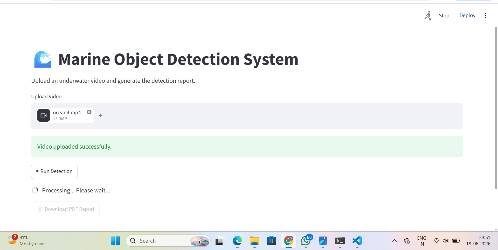
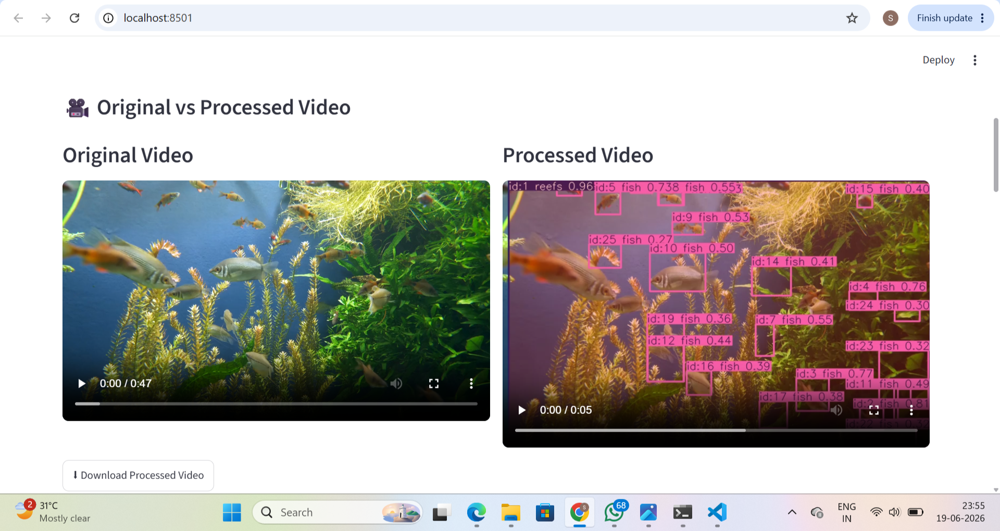
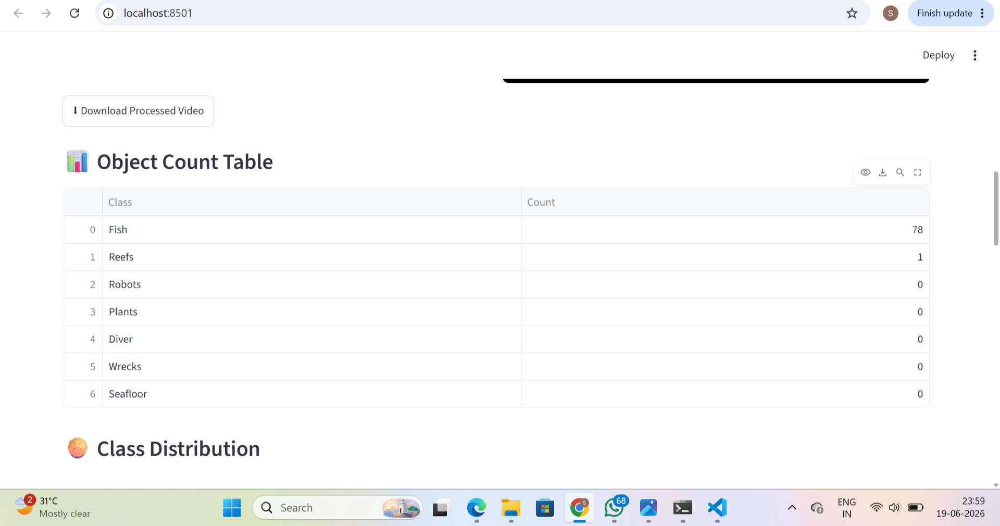
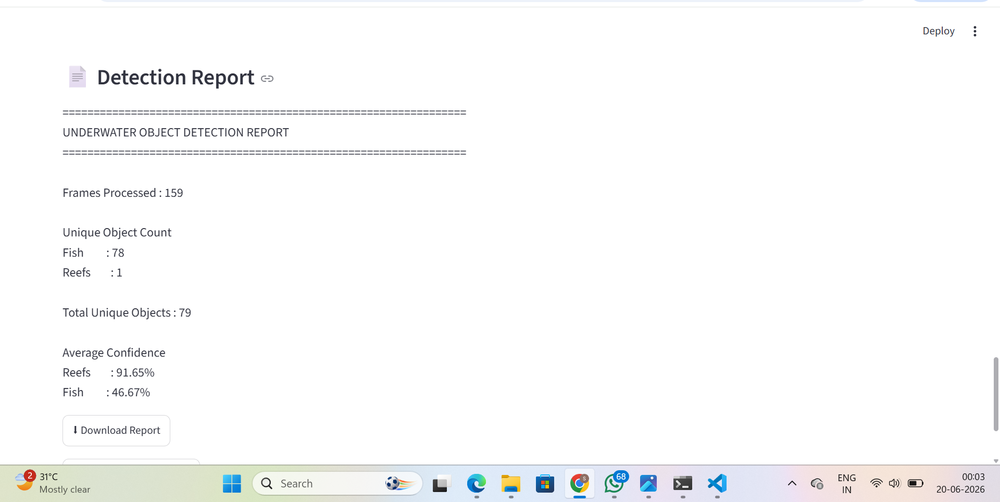

# 🌊 Explainable AI-Based Marine Object Detection and Tracking System

An end-to-end Deep Learning and Computer Vision application developed during my **Summer Internship at IIIT Allahabad** for intelligent underwater video analysis. The system automatically detects, tracks, and analyzes marine objects while providing lightweight Explainable AI visualizations and downloadable analytical reports.

---

## 📌 Project Overview

Marine ecosystem monitoring plays a crucial role in biodiversity conservation, underwater exploration, and environmental research. However, manually analyzing underwater videos is time-consuming and challenging due to poor visibility, color distortion, and large volumes of video data.

This project addresses these challenges by developing an intelligent system capable of automatically detecting, tracking, and analyzing marine objects from underwater videos using **YOLOv8n**, **ByteTrack**, and **Streamlit**.

---

## 🚀 Features

- Real-time marine object detection using **YOLOv8n**
- Multi-object tracking using **ByteTrack**
- Unique object counting across video frames
- Lightweight Explainable AI heatmap visualization
- Class-wise confidence score analysis
- Interactive Streamlit web application
- Automatic TXT and PDF report generation
- Dashboard with object statistics and graphical visualization

---

## 🛠️ Technologies Used

| Category | Technologies |
|----------|--------------|
| Programming Language | Python |
| Deep Learning | YOLOv8n, PyTorch, Ultralytics |
| Computer Vision | OpenCV |
| Object Tracking | ByteTrack |
| Explainable AI | Lightweight Heatmap Visualization |
| Web Framework | Streamlit |
| Data Processing | NumPy, Pandas |
| Visualization | Matplotlib |
| Report Generation | ReportLab |
| Dataset | SUIM (Segmented Underwater Image Dataset) |

---

## 📂 Dataset

**SUIM (Segmented Underwater Image Dataset)**

The YOLOv8n model was trained using the SUIM dataset containing underwater images of:

- Fish
- Reefs
- Aquatic Plants
- Divers
- Wrecks
- Seafloor Regions

**Training Details**

- Model: YOLOv8n
- Image Size: 640 × 640
- Epochs: 50
- Framework: PyTorch + Ultralytics

---

## ⚙️ System Workflow

```text
Input Underwater Video
          │
          ▼
Frame Extraction (OpenCV)
          │
          ▼
YOLOv8n Object Detection
          │
          ▼
ByteTrack Object Tracking
          │
          ▼
Unique Object Counting
          │
          ▼
Explainable AI Heatmaps
          │
          ▼
Statistical Analysis
          │
          ▼
Dashboard Visualization
          │
          ▼
TXT & PDF Report Generation
```

---

## 📊 Results

The developed system is capable of:

- Detecting multiple marine objects from underwater videos
- Tracking objects using unique IDs
- Preventing duplicate counting
- Displaying class-wise confidence scores
- Providing Explainable AI visualizations
- Generating downloadable TXT and PDF reports
- Visualizing object statistics through an interactive dashboard

---

## 📸 Project Screenshots

### 🏠 Home Page

The home page provides a simple and interactive interface where users can upload underwater videos for marine object detection and analysis.



---

### 🎯 Detection Results

The system detects marine objects using the trained YOLOv8n model and displays bounding boxes, class labels, confidence scores, and object tracking information.



---

### 📊 Statistics Dashboard

The dashboard presents real-time statistics, including total detections, class-wise object counts, confidence scores, and other analytical metrics.



---

### 🥧 Object Distribution

A pie chart is generated to visualize the percentage distribution of detected marine object classes, providing a quick overview of underwater biodiversity.


---

### 📄 Generated Report

The application automatically generates a downloadable report containing object statistics, confidence scores, and detection summaries in TXT/PDF format.


---

## 📁 Project Structure

```
Marine-Object-Detection-System
│
├── images/
├── results/
├── README.md
├── app.py
├── video.py
├── image.py
├── classes.txt
└── report.txt
```

---

## ▶️ Installation

### Clone Repository

```bash
git clone https://github.com/Saumya148/Explainable-Marine-Object-Detection-System.git
```

### Install Dependencies

```bash
pip install -r requirements.txt
```

### Run the Application

```bash
streamlit run app.py
```

---

## 🎯 Applications

- Marine Biodiversity Monitoring
- Underwater Exploration
- Coral Reef Assessment
- Marine Research
- Environmental Monitoring
- Ocean Conservation

---

## 🔮 Future Scope

- Real-time underwater camera deployment
- Integration with underwater drones (ROVs)
- Advanced Explainable AI techniques (Grad-CAM)
- Cloud-based monitoring platform
- Support for additional marine species
- Performance optimization for edge devices

---

## 👩‍💻 Author

**Saumya Tamrakar**

B.Tech, Electronics and Communication Engineering

Summer Research Intern, IIIT Allahabad

---

## ⭐ Acknowledgement

This project was developed during my Summer Internship under the guidance of **Dr. Shanti Chandra**, Indian Institute of Information Technology (IIIT) Allahabad.
